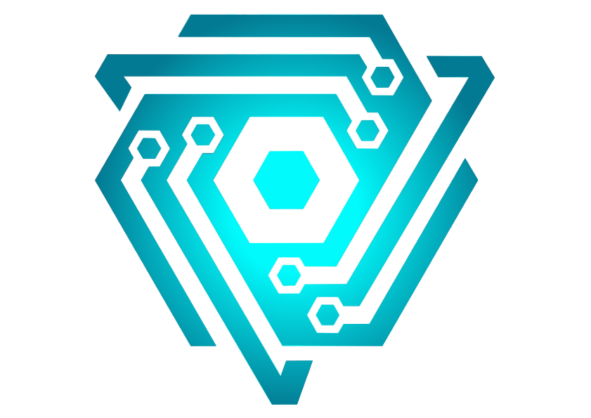
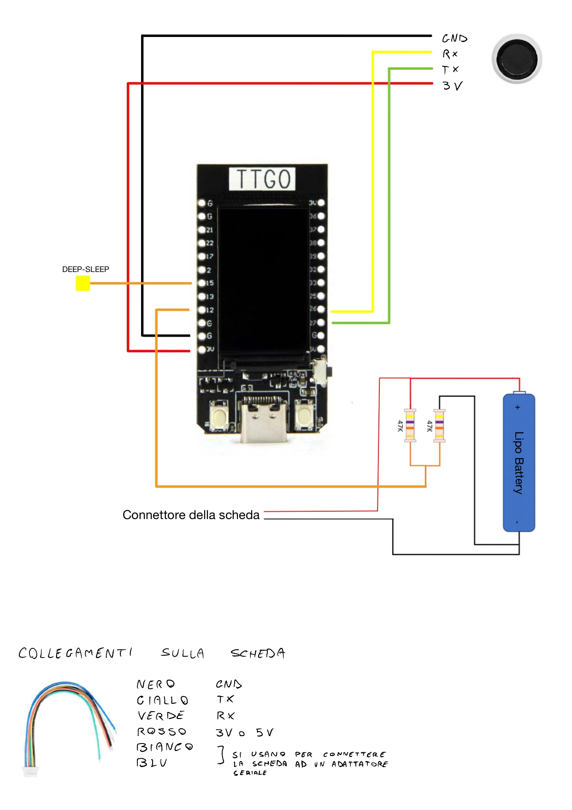
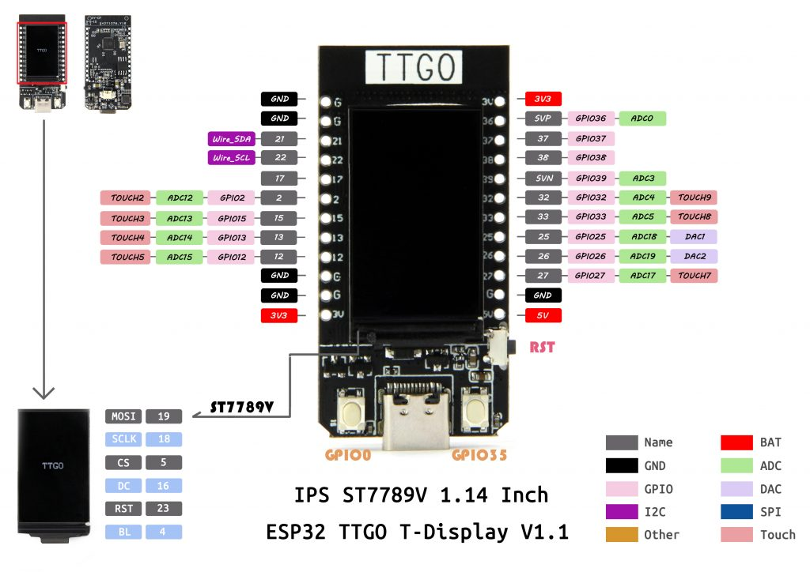
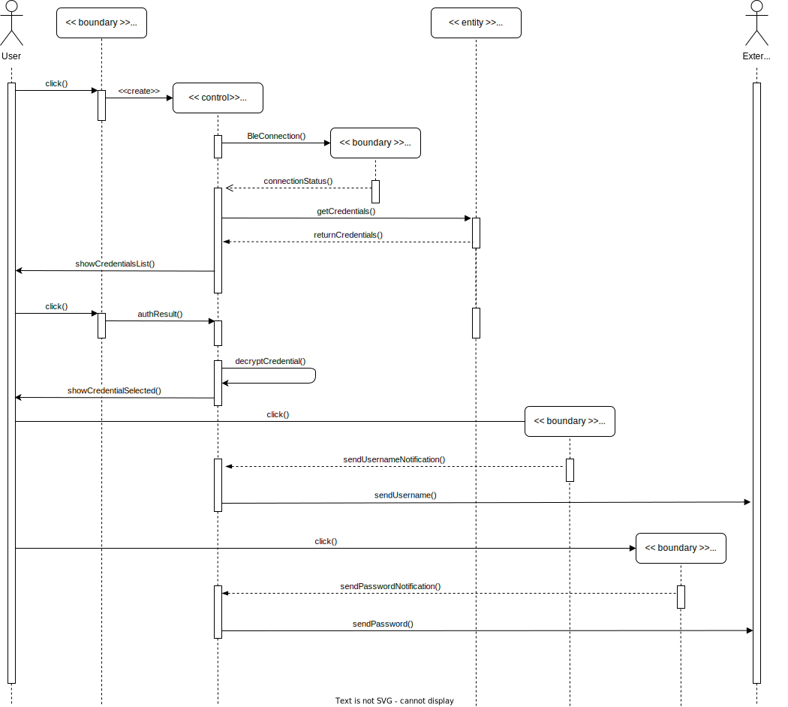
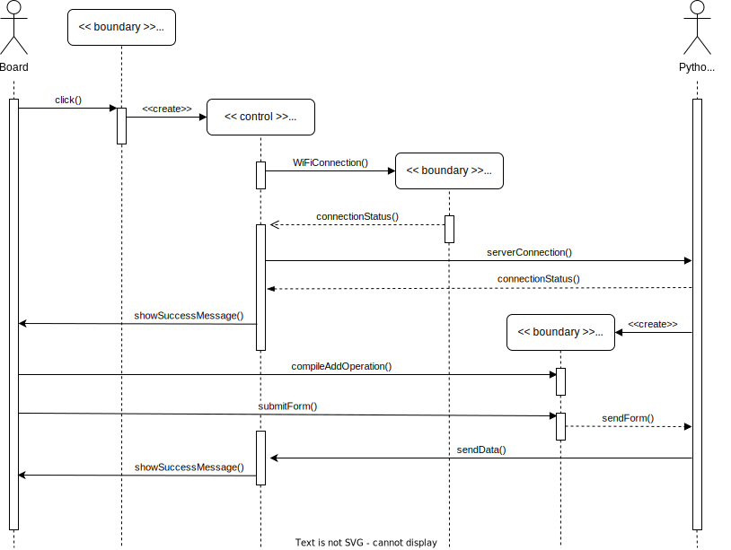

  

   IoT device for password manager. 
   
  A project for IoT Security  
  course at University of Salerno.

<h1 dir="auto">
  <a id="user-content-project-description-and-introduction" class="anchor" aria-hidden="true" href="#project-description-and-introduction">
    <svg class="octicon octicon-link" viewBox="0 0 16 16" version="1.1" width="16" height="16" aria-hidden="true"><path fill-rule="evenodd" d="M7.775 3.275a.75.75 0 001.06 1.06l1.25-1.25a2 2 0 112.83 2.83l-2.5 2.5a2 2 0 01-2.83 0 .75.75 0 00-1.06 1.06 3.5 3.5 0 004.95 0l2.5-2.5a3.5 3.5 0 00-4.95-4.95l-1.25 1.25zm-4.69 9.64a2 2 0 010-2.83l2.5-2.5a2 2 0 012.83 0 .75.75 0 001.06-1.06 3.5 3.5 0 00-4.95 0l-2.5 2.5a3.5 3.5 0 004.95 4.95l1.25-1.25a.75.75 0 00-1.06-1.06l-1.25 1.25a2 2 0 01-2.83 0z">
      </path>
    </svg>
  </a>
  Project description and introduction
</h1>

In this section we introduce context informations for the project.

<h2 dir="auto">
  <a id="user-content-introduction" class="anchor" aria-hidden="true" href="#introduction"><svg class="octicon octicon-link" viewBox="0 0 16 16" version="1.1" width="16" height="16" aria-hidden="true">
    <path fill-rule="evenodd" d="M7.775 3.275a.75.75 0 001.06 1.06l1.25-1.25a2 2 0 112.83 2.83l-2.5 2.5a2 2 0 01-2.83 0 .75.75 0 00-1.06 1.06 3.5 3.5 0 004.95 0l2.5-2.5a3.5 3.5 0 00-4.95-4.95l-1.25 1.25zm-4.69 9.64a2 2 0 010-2.83l2.5-2.5a2 2 0 012.83 0 .75.75 0 001.06-1.06 3.5 3.5 0 00-4.95 0l-2.5 2.5a3.5 3.5 0 004.95 4.95l1.25-1.25a.75.75 0 00-1.06-1.06l-1.25 1.25a2 2 0 01-2.83 0z">
    </path>
    </svg>
  </a>
  Introduction
</h2>

    PassChain is an IoT device to store user's credentials (like username and password) and send them to other devices with a Bluetooth connection. Datas are encrypted with AES-128 bit in GCM mode and the board setup is made connecting PassChain to a server Python with a SSL communication. Each operation is authorized only if the user authenticates himself with a fingerprint.
 The project is produced for the IoT Security course of Master's Degree in Cybersecurity at University of Salerno.

<h1 dir="auto">
  <a id="user-content-technical-informations" class="anchor" aria-hidden="true" href="#technical-informations">
    <svg class="octicon octicon-link" viewBox="0 0 16 16" version="1.1" width="16" height="16" aria-hidden="true">
      <path fill-rule="evenodd" d="M7.775 3.275a.75.75 0 001.06 1.06l1.25-1.25a2 2 0 112.83 2.83l-2.5 2.5a2 2 0 01-2.83 0 .75.75 0 00-1.06 1.06 3.5 3.5 0 004.95 0l2.5-2.5a3.5 3.5 0 00-4.95-4.95l-1.25 1.25zm-4.69 9.64a2 2 0 010-2.83l2.5-2.5a2 2 0 012.83 0 .75.75 0 001.06-1.06 3.5 3.5 0 00-4.95 0l-2.5 2.5a3.5 3.5 0 004.95 4.95l1.25-1.25a.75.75 0 00-1.06-1.06l-1.25 1.25a2 2 0 01-2.83 0z">
      </path>
    </svg>
  </a>
  Technical informations
</h1>

In this section we introduce technical informations and installing guides!

<h2 dir="auto">
  <a id="user-content-built-with" class="anchor" aria-hidden="true" href="#hardware"><svg class="octicon octicon-link" viewBox="0 0 16 16" version="1.1" width="16" height="16" aria-hidden="true">
    <path fill-rule="evenodd" d="M7.775 3.275a.75.75 0 001.06 1.06l1.25-1.25a2 2 0 112.83 2.83l-2.5 2.5a2 2 0 01-2.83 0 .75.75 0 00-1.06 1.06 3.5 3.5 0 004.95 0l2.5-2.5a3.5 3.5 0 00-4.95-4.95l-1.25 1.25zm-4.69 9.64a2 2 0 010-2.83l2.5-2.5a2 2 0 012.83 0 .75.75 0 001.06-1.06 3.5 3.5 0 00-4.95 0l-2.5 2.5a3.5 3.5 0 004.95 4.95l1.25-1.25a.75.75 0 00-1.06-1.06l-1.25 1.25a2 2 0 01-2.83 0z">
    </path>
    </svg>
  </a>
  Hardware
  </h2>

In this section we can see the circuit, in particular, how all the sensors have been connected to the Esp32 and board's datasheet.

<ul dir="auto">
<li><strong>GPIO 15</strong>: metal plaque to wake up the device when it goes in deep sleep after a constant time;</li>
<li><strong>GPIO 12</strong>: battery circuit is composed of two resistence of 47K, because the board has a voltage between 2.3V - 3.6V. The line red and black are connected to the back of the board: here there is a connector that connect battery to the board;</li> 
<li><strong>G</strong>: connection with GND (black line);</li>
<li><strong>Red line</strong>: connection with 3V;</li>
<li><strong>GPIO 26</strong>: is TX on the board (RX on fingerprint);</li>
<li><strong>GPIO 27</strong>: is RX on the board (TX on fingerprint);</li>
</ul>

The blue and white line of the fingerprint are used to connect it to serial adapter but in this case we don’t need to use them.

 
  
  

<h2 dir="auto">
  <a id="user-content-built-with" class="anchor" aria-hidden="true" href="#getting-started"><svg class="octicon octicon-link" viewBox="0 0 16 16" version="1.1" width="16" height="16" aria-hidden="true">
    <path fill-rule="evenodd" d="M7.775 3.275a.75.75 0 001.06 1.06l1.25-1.25a2 2 0 112.83 2.83l-2.5 2.5a2 2 0 01-2.83 0 .75.75 0 00-1.06 1.06 3.5 3.5 0 004.95 0l2.5-2.5a3.5 3.5 0 00-4.95-4.95l-1.25 1.25zm-4.69 9.64a2 2 0 010-2.83l2.5-2.5a2 2 0 012.83 0 .75.75 0 001.06-1.06 3.5 3.5 0 00-4.95 0l-2.5 2.5a3.5 3.5 0 004.95 4.95l1.25-1.25a.75.75 0 00-1.06-1.06l-1.25 1.25a2 2 0 01-2.83 0z">
    </path>
    </svg>
  </a>
  Getting Started
  </h2>

We can see how the user does a quick login to a website using PassChain and how the board does connect to server with SSL protocol.

<h3 dir="auto"><a id="user-content-first-mode" class="anchor" aria-hidden="true" href="#first-mode"><svg class="octicon octicon-link" viewBox="0 0 16 16" version="1.1" width="16" height="16" aria-hidden="true"><path fill-rule="evenodd" d="M7.775 3.275a.75.75 0 001.06 1.06l1.25-1.25a2 2 0 112.83 2.83l-2.5 2.5a2 2 0 01-2.83 0 .75.75 0 00-1.06 1.06 3.5 3.5 0 004.95 0l2.5-2.5a3.5 3.5 0 00-4.95-4.95l-1.25 1.25zm-4.69 9.64a2 2 0 010-2.83l2.5-2.5a2 2 0 012.83 0 .75.75 0 001.06-1.06 3.5 3.5 0 00-4.95 0l-2.5 2.5a3.5 3.5 0 004.95 4.95l1.25-1.25a.75.75 0 00-1.06-1.06l-1.25 1.25a2 2 0 01-2.83 0z"></path></svg></a>Send Credential</h3>

<h3 dir="auto"><a id="user-content-first-mode" class="anchor" aria-hidden="true" href="#first-mode"><svg class="octicon octicon-link" viewBox="0 0 16 16" version="1.1" width="16" height="16" aria-hidden="true"><path fill-rule="evenodd" d="M7.775 3.275a.75.75 0 001.06 1.06l1.25-1.25a2 2 0 112.83 2.83l-2.5 2.5a2 2 0 01-2.83 0 .75.75 0 00-1.06 1.06 3.5 3.5 0 004.95 0l2.5-2.5a3.5 3.5 0 00-4.95-4.95l-1.25 1.25zm-4.69 9.64a2 2 0 010-2.83l2.5-2.5a2 2 0 012.83 0 .75.75 0 001.06-1.06 3.5 3.5 0 00-4.95 0l-2.5 2.5a3.5 3.5 0 004.95 4.95l1.25-1.25a.75.75 0 00-1.06-1.06l-1.25 1.25a2 2 0 01-2.83 0z"></path></svg></a>Server Python</h3>

<h2 dir="auto">
  <a id="user-content-built-with" class="anchor" aria-hidden="true" href="#built-with"><svg class="octicon octicon-link" viewBox="0 0 16 16" version="1.1" width="16" height="16" aria-hidden="true">
    <path fill-rule="evenodd" d="M7.775 3.275a.75.75 0 001.06 1.06l1.25-1.25a2 2 0 112.83 2.83l-2.5 2.5a2 2 0 01-2.83 0 .75.75 0 00-1.06 1.06 3.5 3.5 0 004.95 0l2.5-2.5a3.5 3.5 0 00-4.95-4.95l-1.25 1.25zm-4.69 9.64a2 2 0 010-2.83l2.5-2.5a2 2 0 012.83 0 .75.75 0 001.06-1.06 3.5 3.5 0 00-4.95 0l-2.5 2.5a3.5 3.5 0 004.95 4.95l1.25-1.25a.75.75 0 00-1.06-1.06l-1.25 1.25a2 2 0 01-2.83 0z">
    </path>
    </svg>
  </a>
  Built With
  </h2>
<ul dir="auto">
  <li><a href="https://www.arduino.cc/en/software" rel="nofollow">Arduino IDE</a> - The programming language used for the board development.</li>
  <li><a href="http://www.lilygo.cn/" rel="nofollow">Lora TTgo Esp32</a> - Board used for the project.</li>
  <li><a href="https://www.adafruit.com/product/751" rel="nofollow">Adafruit Fingerprint</a> - Sensor for user authentication.</li>
  <li><a href="#" rel="nofollow">LiPo battery 500 mAh</a> - Battery of 3.7V.</li>
  <li><a href="https://github.com/Mbed-TLS/mbedtls" rel="nofollow">mbedtls/gcm</a> - Library used to encrypt and decrypt datas with AES-128 bit (GCM mode).</li>
  <li><a href="https://github.com/espressif/arduino-esp32/tree/master/libraries/WiFiClientSecure" rel="nofollow">WiFiClientSecure/gcm</a> - Library used to create and setup SSL communication.</li>
  <li><a href="https://github.com/T-vK/ESP32-BLE-Keyboard" rel="nofollow">BleKeyboard</a> - Library used to simulate a virtual keyboard.</li>
  <li><a href="https://www.openssl.org/" rel="nofollow">Openssl</a> - To generate certificates for SSL communication.</li>
  <li><a href=https://www.python.org/" rel="nofollow">Python</a> - The programming language used for server development.</li>
</ul>

<h2 dir="auto">
  <a id="user-content-authors" class="anchor" aria-hidden="true" href="#authors">
    <svg class="octicon octicon-link" viewBox="0 0 16 16" version="1.1" width="16" height="16" aria-hidden="true"><path fill-rule="evenodd" d="M7.775 3.275a.75.75 0 001.06 1.06l1.25-1.25a2 2 0 112.83 2.83l-2.5 2.5a2 2 0 01-2.83 0 .75.75 0 00-1.06 1.06 3.5 3.5 0 004.95 0l2.5-2.5a3.5 3.5 0 00-4.95-4.95l-1.25 1.25zm-4.69 9.64a2 2 0 010-2.83l2.5-2.5a2 2 0 012.83 0 .75.75 0 001.06-1.06 3.5 3.5 0 00-4.95 0l-2.5 2.5a3.5 3.5 0 004.95 4.95l1.25-1.25a.75.75 0 00-1.06-1.06l-1.25 1.25a2 2 0 01-2.83 0z">
      </path>
    </svg>
  </a>
  Author & Contacts
</h2>
<ul dir="auto">
<li><strong>Alberto Montefusco</strong>   - <em>Developer</em>   - <a href="https://github.com/Alberto-00">Alberto-00</a></li>
<li>Email - <a href="mailto:a.montefusco28@studenti.unisa.it">a.montefusco28@studenti.unisa.it</a></li>
<li>LinkedIn - <a href="https://www.linkedin.com/in/alberto-montefusco">Alberto Montefusco</a></li>
</ul>
